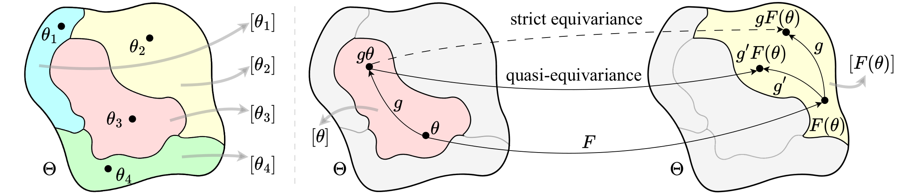

# Quasi-Equivariant Metanetworks

[](https://iclr.cc/Conferences/2026)

Official implementation of the paper "Quasi-Equivariant Metanetworks" (ICML 2026).


## Setup
 
Follow the installation in each folder "MonomialNFNQuasi" and "TransformerNFNQuasi".

## Usage

### Reproduce the experiments
Please see the README file in `experiments` folder.

## Citation

If you find this code useful in your research, please cite our paper:

```@inproceedings{
tran2026quasiequivariant,
title={Quasi-Equivariant Metanetworks},
author={Viet-Hoang Tran and An Nguyen The and Beno{\^\i}t Gu{\'e}rand and Thieu Vo and Tan Minh Nguyen},
booktitle={The Fourteenth International Conference on Learning Representations},
year={2026},
url={https://openreview.net/forum?id=XMiDpi2mWY}
}
```

## License

This project is licensed under the Attribution-NonCommercial-ShareAlike 4.0 International License - see the [LICENSE](LICENSE) file for details.

## Contact

For questions about the code or paper, please open an issue in this repository or contact the authors directly.